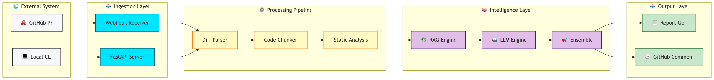
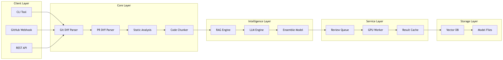
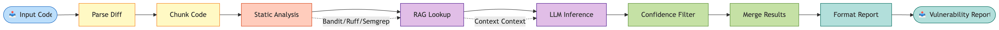
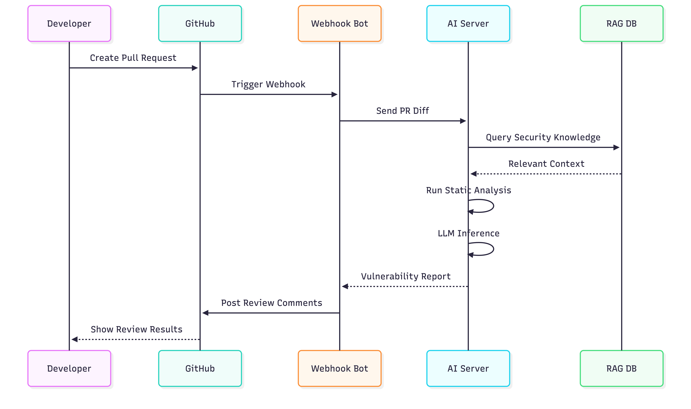

# AI Code Review System

<div align="center">

[](https://www.python.org/)
[](LICENSE)
[](https://www.docker.com/)
[](https://fastapi.tiangolo.com/)

Automated AI-powered security code review using LLMs, static analysis, and retrieval-augmented generation.

</div>

---

## ❗ Problem

Modern codebases are large and fast-moving. Manual code reviews are time-consuming, error-prone, and often miss subtle security vulnerabilities. Most teams lack the bandwidth or expertise to perform deep security reviews on every pull request.

---

## 💡 Solution

**AI-Code-Review-System** automates security code review using large language models (LLMs), static analysis tools, and retrieval-augmented reasoning. It reviews code changes, identifies vulnerabilities, and provides structured explanations directly in GitHub pull requests or via a local CLI.

### ✨ Key Capabilities

| Capability | Description |
|------------|-------------|
| 🔍 **LLM-based Detection** | Advanced vulnerability detection using large language models |
| 📊 **Static Analysis** | Bandit, Ruff, Semgrep integration for pattern matching |
| 🧠 **RAG Knowledge Base** | Retrieval-augmented security knowledge from OWASP/CWE |
| ⚡ **GPU Acceleration** | Fast inference using vLLM with quantization |
| 🔗 **GitHub Integration** | Automated PR reviews with comments |
| 💻 **Local CLI** | Scan repositories locally with ease |
| 📈 **Evaluation Framework** | Benchmark precision, recall, and F1 scores |

---

## 🏗️ Architecture

### System Data Flow



### Component Architecture



### Security Scanning Pipeline



---

## 🚀 Demo Command

Try it instantly with a single curl command:

```bash
curl -X POST http://localhost:8000/review \
    -H "Content-Type: application/json" \
    -d '{
        "prompt": "def authenticate(username, password):\n    if username == \"admin\" and password == \"123456\":\n        return True"
    }'
```

---

## ✅ Results (Sample Output)

```json
{
    "results": [
        {
            "issue": "hardcoded credential",
            "severity": "critical",
            "confidence": 0.98,
            "cwe_id": "CWE-798",
            "explanation": "Credentials should never be stored directly in source code. Use environment variables or a secrets manager.",
            "line_number": 2,
            "suggestion": "Use os.environ.get('PASSWORD') or a secrets manager"
        }
    ],
    "scan_metadata": {
        "files_scanned": 1,
        "vulnerabilities_found": 1,
        "scan_time_ms": 234
    }
}
```

---

## 🌟 Why This Matters

| Benefit | Impact |
|---------|--------|
| ⏱️ **Saves Time** | Automates tedious, repetitive review tasks |
| 🐛 **Finds More Bugs** | Catches subtle vulnerabilities missed by humans |
| 📈 **Scales Easily** | Every PR gets a security review, instantly |
| 💡 **Actionable** | Explains issues in plain language, right in your workflow |
| 🔗 **Integrates Anywhere** | Use as a GitHub bot or local CLI |

---

## 🛡️ Supported Vulnerabilities

| Category | Issues Detected |
|----------|-----------------|
| 🔑 **Credentials** | Hardcoded passwords, API keys, tokens |
| 💉 **Injection** | SQL injection, Command injection, XSS |
| 📁 **File Operations** | Path traversal, unsafe file handling |
| 🔐 **Cryptography** | Weak encryption, insecure random |
| 🔓 **Authentication** | Weak auth, session issues |
| 📦 **Deserialization** | Unsafe pickle/yaml loading |
| 🌐 **Network** | Insecure SSL, trust boundaries |
| ⚙️ **Best Practices** | Security misconfigurations |

---

## 🔄 Example Workflow



---

## 💻 CLI Usage

```bash
# Review a single file
python cli/main.py review path/to/file.py

# Scan entire repository
python cli/main.py scan ./src

# Check diff against main branch
python cli/main.py diff --base main
```

---

## 🐳 Quick Start (Docker)

```bash
# Clone and navigate to project
cd AI-Code-Review-System

# Start all services
docker compose up --build
```

**Start the AI server:**
```bash
uvicorn server.app:app --host 0.0.0.0 --port 8000
```

**(Optional) Start the GitHub bot:**
```bash
uvicorn integrations.github_bot:app --host 0.0.0.0 --port 9000
```

**Expose your local server with ngrok:**
```bash
ngrok http 8000
# or for the GitHub bot:
ngrok http 9000
```

Copy the public ngrok URL and use it for webhooks or remote API access.

Services will be available at:
- **AI Server**: http://localhost:8000
- **GitHub Bot**: http://localhost:9000

---

## 📊 Evaluation

Run the evaluation framework to measure system performance:

```bash
python -m evaluation.evaluator
```

### Metrics Tracked

| Metric | Description |
|--------|-------------|
| 🎯 **Precision** | True positives / (True positives + False positives) |
| 📣 **Recall** | True positives / (True positives + False negatives) |
| 📐 **F1 Score** | Harmonic mean of precision and recall |

---

## 📦 Project Structure

```
AI-Code-Review-System/
├── 📂 cli/                    # Command-line interface
│   ├── __init__.py
│   ├── chunker.py
│   ├── client.py
│   ├── diff_parser.py
│   ├── git_utils.py
│   ├── github_integration.py
│   ├── main.py
│   ├── prompt_builder.py
│
├── 📂 core/                   # Core processing engine
│   ├── __init__.py
│   ├── git_diff_parser.py
│   ├── pr_diff_parser.py
│   ├── report_generator.py
│   ├── static_analysis.py
│
├── 📂 server/                 # FastAPI server and LLM engine
│   ├── __init__.py
│   ├── app.py
│   ├── cache.py
│   ├── ensemble.py
│   ├── gpu_worker.py
│   ├── llm_engine.py
│   ├── model_loader.py
│   ├── rag.py
│   ├── review_queue.py
│   ├── reviewer.py
│
├── 📂 integrations/           # Third-party integrations
│   └── github_bot.py
│
├── 📂 evaluation/             # Evaluation framework
│   ├── __init__.py
│   ├── benchmark.py
│   ├── dataset.json
│   ├── evaluator.py
│   └── metrics.py
│
├── 📂 dataset/                # Training datasets
│   ├── generate_dataset.py
│   ├── dataset/               # Dataset files
│   │   └── security_dataset.json
│   ├── fastapi/               # Example data (if present)
│   ├── flask/
│   └── requests/
│
├── 📂 scripts/                # Utility scripts
│   └── preflight_check.py
│
├── 📂 tests/                  # Test suite
│   ├── test_github_webhook.py
│   └── test_server_review.py
│
├── 📂 data/                   # Cache and artifacts
│   └── cache.json
│
├── 🐳 docker-compose.yml      # Docker orchestration
├── 📜 Dockerfile              # Container definition
├── ⚙️  pyproject.toml         # Python project config
├── 📦 requirements.txt        # Python dependencies
├── 📝 Makefile                # Automation commands
├── 🔑 .env                    # Environment variables (user-provided)
├── 🔑 .env.example            # Example environment file
├── 📄 README.md               # This file
├── 🚀 run_end_to_end_demo.sh  # End-to-end demo script
├── 🚀 start_dev.sh            # Dev server startup script
├── 🛠️  update_webhook.py      # Webhook update utility
├── 📦 ngrok-v3-stable-linux-amd64.tgz.1  # ngrok binary (example)
├── 📦 ngrok-v4-stable-linux-amd64.zip.1  # ngrok binary (example)
├── 📄 fastapi.pid             # FastAPI process ID (runtime)
```

---

## 📚 Security Knowledge Base

The RAG system retrieves context from:

- 📖 **OWASP Top 10** - Web application security risks
- 🔒 **CWE** - Common Weakness Enumeration
- 📋 **CVE Databases** - Public vulnerability reports
- 🔧 **Best Practices** - Security coding guidelines

---

## ⚠️ Limitations

> **Important**: LLMs are powerful but not a replacement for expert security audits. This tool should be used as an assistant, not a sole authority. Always validate critical findings with security experts.

---

## 🚧 Future Improvements

- [ ] Larger datasets & fine-tuning
- [ ] Multi-model ensemble
- [ ] Security dashboard UI
- [ ] Repository-wide scanning
- [ ] Continuous learning from feedback
- [ ] Support for more languages

---

## 👤 Author

**Shivang Gupta**  

---

## 📄 License

<div align="center">

MIT License © 2026

*For research and educational use.*

</div>

---

<div align="center">

**If you find this project useful, please ⭐ star it!**

</div>
